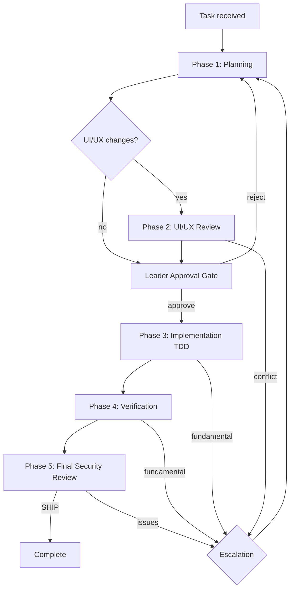

# Team Workflow Orchestration

Orchestrates a multi-agent team through 5 phases with escalation support.

## Quick Reference

- **Agents**: See `resources/agents.md` for role summary and invocation patterns
- **Escalation**: See `resources/escalation.md` for rules, limits, and report formats

## Orchestration Flow



## Pre-Flight: Project Profile Check

Before starting any phase, verify `.claude/project-profile/index.md` exists.
- If it exists: include `index.md` content in all agent prompts as context
- If it does NOT exist: prompt user to run `/team-init` first, then proceed

**Loading rule**: Only `index.md` is required. Agents load other profile files on-demand based on relevance (see index.md's file table). Some files may not exist — agents fall back to general best practices.

## Phase 1: Planning

### Step 1: Spawn Team Leader

Read `.claude/agents/team-leader.md` and spawn with the task description.
Include `.claude/project-profile/index.md` content in the prompt.

For `/team` mode: Include instruction "Ask the user about ambiguous decisions."
For `/team-run` mode: Include instruction "Make all decisions autonomously."

### Step 2: Spawn Architects A + B (parallel)

After Leader produces rough plan, spawn both architects in parallel:

```
Agent(prompt="[team-architect-fe.md content]\n\nLeader Plan:\n[plan]\n\nCreate detailed frontend plan.")
Agent(prompt="[team-architect-be.md content]\n\nLeader Plan:\n[plan]\n\nCreate detailed backend plan.")
```

### Step 3: Cross-Review

Use TeamCreate to create a dialog between Leader + Arch A + Arch B.
Each reviews the other's plan. Leader mediates and finalizes.

### Step 4: Optional Arch C

If Leader flagged infra/security concerns, spawn Architect C:
```
Agent(prompt="[team-architect-infra.md content]\n\nPlan:\n[consolidated plan]\n\nReview for infra/security concerns.")
```

### Step 5: Save Plan to _docs/

Write the consolidated plan to `_docs/{category}/plan-{feature}.md`.
Update `_docs/index.md` with the new entry.

```
_docs/
├── index.md              # Always update this
├── {category}/
│   └── plan-{feature}.md # Team plan document
```

The plan document follows the template defined in `team-leader.md` (Plan Document Template section).
Status starts as "Planning" and progresses through "In Progress" → "Verification" → "Complete".

## Phase 2: UI/UX (Conditional)

Only if Leader indicated UI/UX changes needed:

```
Agent(prompt="[team-uiux-master.md content]\n\nPlan:\n[plan]\n\nReview and propose UI/UX modifications.")
```

If UI/UX Master reports conflicts → escalate to Phase 1.

## Leader Approval Gate

Present the final plan (Phase 1 + Phase 2 results) to Leader for approval.

- Approve → proceed to Phase 3
- Reject → return to Phase 1 with Leader's feedback

## Phase 3: Implementation (TDD)

### Step 1: Parse File Assignments

From Leader's plan, extract Designer assignments:
```
Designer 1: [file-a, file-b] → worktree-1
Designer 2: [file-c, file-d] → worktree-2
```

### Step 2: Spawn Designers (parallel, worktree isolated)

For each Designer:
```
Agent(
  prompt="[team-designer.md content]\n\nYour assignment:\nFiles: [list]\nPlan: [relevant section]\n\nImplement using TDD.",
  isolation="worktree",
  mode="bypassPermissions"
)
```

### Step 3: Merge Worktrees

1. Create merge branch from current base
2. Merge each worktree sequentially
3. Resolve any conflicts
4. Commit merged result

### Step 4: Update _docs/

Update `_docs/{category}/plan-{feature}.md` with implementation notes. Set status to "In Progress".

## Phase 4: Verification

### Step 1: Spawn Testers (parallel)

```
Agent(
  prompt="[team-tester.md content]\n\nImplementation reports:\n[reports]\n\nPlan:\n[plan]\n\nVerify all tests pass.",
  mode="bypassPermissions"
)
```

### Step 2: Collect Results

If all tests pass → update `_docs/` plan with test results, set status to "Verification" → proceed to Phase 5.
If failures → check escalation rules (resources/escalation.md).

## Phase 5: Final Security Review

Always invoke Architect C:

```
Agent(
  prompt="[team-architect-infra.md content]\n\nImplemented code diff:\n[git diff]\n\nPerform final security audit.",
  mode="bypassPermissions"
)
```

- SHIP → update `_docs/` plan status to "Complete" with final summary, report success to user
- Issues found → escalate per escalation rules

## Escalation Handling

On any escalation:
1. Report to user: `⚠ ESCALATION: [source] → [target]. Reason: [reason]`
2. Check retry counts (max 3 per phase, max 3 global cycles)
3. If limits exceeded: ABORT and report to user
4. Otherwise: re-enter target phase with escalation context

## State Tracking

The orchestrator maintains:
- `currentPhase`: 1-5
- `retryCounts`: { phase1: N, phase2: N, phase3: N, phase4: N, phase5: N }
- `globalCycles`: N (times returned to Phase 1)
- `designerAssignments`: [{ designer: N, files: [...], worktree: path }]
- `escalationLog`: [{ from, to, reason, timestamp }]
