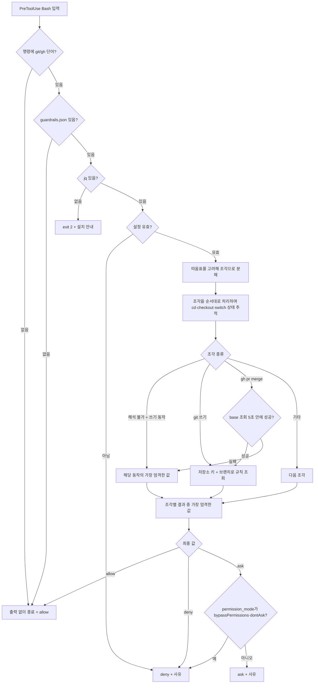

# 가드레일 1단계 설계

요청과 제약은 intent에 있다. 이 문서는 구현 방법을 정한다.

## 검토한 접근

| 접근 | 내용 | 결과 |
|---|---|---|
| A. 기본 규칙 + 얇은 훅 | 금지 명령은 Claude `permissions.deny`, 브랜치 상태가 필요한 규칙만 훅 | **채택** |
| B. 훅 하나로 전부 | 체인·서브셸·래퍼 분해를 bash로 재구현 | 기각. 버그 표면이 크고 기본 규칙과 결과가 어긋날 수 있음 |
| C. 기본 규칙만 | 훅 없음 | 기각. 「stage에 있을 때 commit」 같은 상태 의존 규칙을 표현할 수 없음 |
| A′. 공통 평가기 + 기본 규칙 보조 | Codex까지 한 평가기로 | Codex 단계로 미룸. 1단계 스키마는 그대로 확장 가능 |

근거가 된 사실 (2026-09-23 문서 확인):

- Claude Code 기본 `deny`/`ask` 규칙은 `&&` `||` `;` `|` `&`와 줄바꿈으로 명령을 나누고, 서브셸·`$(...)`·제어문 본문 안까지 검사한다. `ask`는 auto 모드에서도 확인 창을 강제한다.
- `bypassPermissions`는 확인 창을 건너뛴다. 이 모드에서 기본 `ask`가 어떻게 되는지는 문서에 없다. 훅의 `deny`는 항상 지켜진다.
- 플러그인 훅은 서브에이전트 안에서도 돈다. 입력에 `agent_id`가 들어온다.
- 훅에는 `CLAUDE_PROJECT_DIR`이 전달되고, 입력 JSON에 `cwd`, `permission_mode`, `session_id`가 있다.

## 규칙 분담

- **금지 명령** (브랜치와 무관): 프로젝트 `.claude/settings.json`의 `permissions.deny`. 예: `Bash(pnpm test)`, `Bash(pnpm test -- *)`. 프로젝트마다 달라서 프리셋에 넣지 않고 README에 예시로 둔다.
- **브랜치 규칙**: 새 훅 `hooks/guardrails.sh`.

## 설정 파일

위치: `$CLAUDE_PROJECT_DIR/.claude/project-profile/guardrails.json`. 없으면 훅은 아무것도 하지 않는다.

```json
{
  "version": 1,
  "repos": {
    ".":  { "branches": [ { "pattern": "main", "commit": "deny", "push": "deny", "merge": "deny" } ] },
    "be": { "branches": [ { "pattern": "main", "merge": "deny" },
                          { "pattern": "stage", "commit": "ask", "push": "ask" } ] }
  }
}
```

- `repos` 키: 프로젝트 루트 기준 저장소 경로. `"."`은 루트 저장소다. 설정에 없는 저장소는 규칙이 없으므로 허용한다.
- `pattern`: bash glob (`main`, `release/*`). 한 브랜치에 여러 행이 맞으면 **가장 엄격한 값**을 쓴다. 행 순서와 무관하다.
- 값: `allow` / `ask` / `deny`. 적지 않은 동작은 `allow`.
- 검증: `version == 1`이고 `repos`가 객체가 아니면 설정 오류다. git·gh 명령은 사유와 함께 `deny`한다(fail-closed).

### 저장소 식별

훅은 대상 디렉터리의 `git rev-parse --path-format=absolute --git-common-dir`를, 설정에 있는 각 키의 같은 값과 비교해 키를 찾는다. 그래서 루트 저장소의 linked worktree(`/team-run` Designer 워크트리)도 `"."`으로 매핑된다. `--show-toplevel` 상대 경로로 비교하면 워크트리가 설정 밖으로 빠진다.

## 동작 분류

| 분류 | 명령 | 판정 브랜치 |
|---|---|---|
| `commit` | `git commit`, `merge`, `rebase`, `cherry-pick`, `revert`, `am`, `pull` | 그 시점의 현재 브랜치 |
| `push` | `git push` | refspec의 대상 브랜치. 생략하면 현재 브랜치. `--all`·`--mirror`는 그 저장소 `push` 값 중 가장 엄격한 값 |
| `merge` | `gh pr merge` | PR의 base 브랜치 |

push refspec 해석: `+` 접두사를 떼고, `src:dst`와 `:dst`(삭제)는 dst, 콜론이 없으면 그 이름, `HEAD`는 현재 브랜치다. `refs/heads/`는 떼고, `refs/tags/`와 `--tags`는 브랜치가 아니므로 판정하지 않는다.

## 판정 흐름



### 분해와 상태 추적

- 따옴표 밖의 `&&` `||` `;` `|` `&`와 줄바꿈에서 자른다. 작은따옴표, 큰따옴표, 백슬래시 이스케이프를 인식한다.
- 조각 앞의 `VAR=value` 대입은 떼고 본다.
- **해석 불가**: `$(`, 백틱, `<(`가 있거나, `bash`/`sh`/`zsh -c`, `eval`, `xargs`로 시작하거나, `(`·`{`로 시작하는 조각. 이런 조각 안에 쓰기 동작 단어(`commit` `push` `merge` `rebase` `cherry-pick` `revert` `am` `pull`, 또는 `gh pr merge`)가 보이면, 그 동작의 모든 저장소·패턴 중 가장 엄격한 값을 적용한다.
- `cd <경로>`: 리터럴 경로면 현재 위치를 갱신한다(`~`는 `$HOME`). `$`가 들어가거나 인자가 없거나 `cd -`이면, 이후 조각의 위치를 알 수 없음으로 표시한다. 그 뒤의 쓰기 동작은 해석 불가와 같이 처리한다.
- `git` 전역 옵션: `-C <경로>`는 위치에 누적하고, `-c k=v`는 건너뛴다. `--git-dir`·`--work-tree`는 해석 불가로 처리한다.
- `git checkout <b>` / `-b <b>`, `git switch <b>` / `-c <b>`: 그 저장소의 이후 판정 브랜치를 `<b>`로 바꾼다. `--`가 있거나 `<b>`가 로컬 브랜치가 아니면 파일 복원으로 보고 무시한다.
- detached HEAD(현재 브랜치 없음): 그 동작의 저장소 내 가장 엄격한 값.

### `gh pr merge`

`gh pr view <인자> --json baseRefName -q .baseRefName`을 조각의 위치에서 실행한다. `-R`은 그대로 전달한다. macOS에 GNU `timeout`이 없으므로, bash 백그라운드 실행 + 대기로 5초 제한을 직접 구현한다. 실패하거나 시간이 넘으면, 그 저장소 `merge` 값 중 가장 엄격한 값을 적용한다. `-R`로 다른 저장소를 가리키면 저장소 키를 알 수 없으므로 모든 저장소의 `merge` 중 가장 엄격한 값을 쓴다.

### 출력

- allow: 출력 없이 exit 0. 프로젝트의 다른 권한 판단에 맡긴다.
- ask / deny: `hookSpecificOutput.permissionDecision`과 사유. 사유에는 동작, 저장소 키, 판정 브랜치, 맞은 패턴, 값을 넣는다. 메시지는 기존 훅과 같이 영어로 쓴다. 예: `[guardrails] deny — git push → repo "be" branch "main" (pattern "main", push=deny). Ask the user to run it, or change .claude/project-profile/guardrails.json.`
- ask를 deny로 올린 경우: 사유 끝에 `This needs human confirmation, but permission_mode=bypassPermissions cannot show a prompt — ask the user to run it.`를 붙인다.

## 프리셋

`hooks/guardrails/presets/` (모두 루트 저장소 `"."` 기준, 서브모듈은 사용자가 행을 추가):

| 파일 | 내용 |
|---|---|
| `default.json` | **권장.** 운영 브랜치 `main` `master` `prod` `prd` `production` = commit·push·merge `deny`. 공유 브랜치 `stage` `staging` `dev` `develop` = `ask`. 기능 브랜치는 규칙 없음(허용) |
| `light.json` | 운영 브랜치 = `ask`. 그 외 규칙 없음 |
| `toy.json` | `"repos": {}`. 규칙 없이 쓰겠다는 명시적 선택. 설정 안내를 멈춘다 |

「나머지 = ask」는 공유 브랜치만 뜻한다. 기능 브랜치까지 ask로 두면 `/team-run` Designer 워크트리 커밋이 bypass 모드에서 deny가 되어 워크플로가 멈춘다.

## 설정 유도 (의무 아님)

`hooks/session-start.sh`에 한 블록 추가. 조건과 출력:

- `$CLAUDE_PROJECT_DIR/.claude/project-profile/`가 있고(harness를 쓰는 프로젝트) `guardrails.json`이 없을 때만, 세션 시작마다 한 줄 출력한다.
- 출력: `[guardrails] No branch rules for this project. Recommended: cp "<plugin>/hooks/guardrails/presets/default.json" .claude/project-profile/guardrails.json (production branches deny, stage/dev ask). To opt out, copy toy.json instead and this notice stops.`
- 파일이 있으면(`toy` 포함) 아무것도 출력하지 않는다. 설정하지 않아도 동작은 바뀌지 않는다.

## 수정할 파일

| 파일 | 변경 |
|---|---|
| `hooks/guardrails.sh` | 신규 |
| `hooks/hooks.json` | PreToolUse, matcher `Bash` 추가 |
| `hooks/guardrails/presets/{default,light,toy}.json` | 신규 |
| `hooks/session-start.sh` | 설정 유도 한 줄 |
| `hooks/guardrails/tests/run.sh` | 신규. 케이스를 파일 안에 표로 둔다 |
| `README.md` | Guardrails 절 |
| `CHANGELOG.md` | v1.30.0 항목 (배포 때 v1.29.0 항목과 합침) |

## 테스트

### 표 형식 러너 (`hooks/guardrails/tests/run.sh`)

임시 디렉터리에 루트 저장소와 내부 저장소 `be/`, 루트의 linked worktree 하나를 만든다. 케이스마다 설정·브랜치를 맞추고 가짜 입력 JSON을 훅에 넣어 판정과 사유를 확인한다. `gh`는 PATH 앞의 가짜 스크립트로 대신한다. 실패 케이스가 하나라도 있으면 exit 1.

| 케이스 | 기대 |
|---|---|
| default, `main`에서 `git commit` | deny |
| 기능 브랜치에서 `git commit` | 출력 없음 |
| `cd be && git commit` (be `stage` = ask) | ask |
| `git -C be push origin HEAD:stage` | ask |
| `git checkout main && git commit` | deny |
| `git push origin +feature:main` | deny |
| `git push --tags` | 출력 없음 |
| `git push --all` | 가장 엄격한 값 |
| `echo $(git push)`, `bash -c "git push"` | 가장 엄격한 값 |
| `cd "$DIR" && git commit` | 가장 엄격한 값 |
| `gh pr merge 12`: 가짜 gh가 `main` 반환 / 실패 / 6초 지연 | deny / 가장 엄격한 값 / 가장 엄격한 값 |
| ask + `bypassPermissions`, ask + `dontAsk` | deny + 사유 |
| linked worktree에서 `main`으로 switch 후 commit | deny (`"."` 규칙) |
| detached HEAD에서 commit | 가장 엄격한 값 |
| 겹치는 패턴 (`*` = allow, `main` = deny) | deny |
| 설정 없음 / `ls -la` | 출력 없음 |
| 설정 오류 (`version: 2`) | deny |
| jq가 없는 PATH + `git commit` | exit 2 |
| session-start: 프로필 있음 + 설정 없음 / toy 있음 / 프로필 없음 | 안내 1줄 / 출력 없음 / 출력 없음 |

### 실제 Claude 스모크

`smoke-fixture`에 default 프리셋을 두고, `claude -p --plugin-dir <이 저장소>`로 실행한다.

1. 메인 세션에게 `main`에서 커밋을 시킨다. 로그에서 deny와 사유가 모델에게 전달됐는지 확인한다.
2. 서브에이전트에게 같은 커밋을 시킨다. 서브에이전트 안에서도 막히는지 확인한다.
3. light 프리셋(ask)으로 바꾸고 headless에서 어떻게 처리되는지 관찰해 기록한다.

### 미검증으로 남길 것

- 대화형 세션에서 확인 창이 뜨는 모습.
- Windows Git Bash. 회사 PC에서 `run.sh`를 실행해야 한다.

## 위험

- **bash 파서의 빈틈**: 따옴표 중첩, heredoc 등 흔하지 않은 형태에서 오판할 수 있다. 판단할 수 없으면 엄격한 쪽으로 기울도록 설계했다. 사례가 나오면 러너 케이스로 추가한다.
- **성능**: git·gh 단어가 있는 명령에서만 git을 몇 번 호출한다. `gh pr merge`만 네트워크를 쓴다.
- **오탐으로 작업이 막힘**: 사유에 맞은 규칙을 적으므로 사용자가 설정을 고치거나 직접 실행할 수 있다.

## 구현 결과와 검증 (2026-09-23)

- 구현 파일: `hooks/guardrails.sh`, `hooks/hooks.json`(PreToolUse `Bash`, timeout 15 s), `hooks/guardrails/presets/{default,light,toy}.json`, `hooks/session-start.sh`(설정 안내), `hooks/guardrails/tests/run.sh`, `README.md` Guardrails 절, `CHANGELOG.md` v1.30.0(미배포).
- 메시지는 기존 훅과 같이 영어로 출력한다.
- `claude plugin validate` `.`·`skills`·`agents`·`commands` `--strict` 통과, `git diff --check` 통과, `bash -n` 통과.
- 표 형식 러너: macOS `/bin/bash` 3.2.57에서 **36 passed, 0 failed**, exit 0. `gh` 5초 제한은 가짜 gh 6초 지연에서 5초에 돌아왔다.
- 러너 자체 검증: 훅을 아무것도 하지 않는 스크립트로 바꾸면 **23 failed**, exit 1. 통과한 13건은 원래 「출력 없음」을 기대하는 케이스다.
- 실제 Claude 스모크 (fixture, `claude -p --plugin-dir <이 저장소> --setting-sources project,local --permission-mode auto`, 사용자 설정 제외로 brain push 훅 미실행):
  - default 프리셋: `git checkout main && git commit …` 한 명령 → deny (체인 안의 전환 반영, checkout도 실행 안 됨). `git checkout main` 단독 → 허용, 이어서 `git commit …` → deny. general-purpose 서브에이전트의 `git commit …` → deny. 사유 문구가 모델에게 `PreToolUse:Bash hook error: [guardrails] deny — …`로 전달됐다. main HEAD 변화 없음(`09ed703`).
  - light 프리셋(ask): headless에서 확인 창을 띄울 수 없어 `permission_denials`에 기록되고 커밋은 일어나지 않았다. 사유 문구는 모델에게 전달됐다.

## Deferred QA

### QA-2026-09-23-guardrails-spec-01 — Windows Git Bash에서 러너 통과
- Priority: P1
- Preconditions: 회사 Windows PC, Git for Windows(Git Bash), `jq`와 `git` 설치, 이 저장소 체크아웃.
- Actions: Git Bash에서 `bash hooks/guardrails/tests/run.sh` 실행.
- Expected: 마지막 줄 `36 passed, 0 failed`, exit 0. 실패가 있으면 케이스 이름과 출력을 기록.
- Source: README Guardrails 절 「Windows Git Bash is not yet verified」, 이 spec 「미검증으로 남길 것」.
- Status: pending
- Evidence: —

### QA-2026-09-23-guardrails-spec-02 — 대화형 세션의 ask 확인 창
- Priority: P2
- Preconditions: light 프리셋을 둔 harness 프로젝트, 대화형 Claude Code 세션(기본 권한 모드), 운영 브랜치 체크아웃.
- Actions: 에이전트에게 `git commit --allow-empty -m test`를 시키고 확인 창을 관찰한 뒤, 한 번은 거부하고 한 번은 승인.
- Expected: `[plugin:junjak-ai-harness]` 표시와 `[guardrails] ask — …` 사유가 담긴 확인 창이 뜬다. 거부하면 커밋이 없고, 승인하면 커밋이 생긴다.
- Source: 이 spec 「출력」 절, Claude Code hooks 문서의 `ask` 동작.
- Status: pending
- Evidence: —
