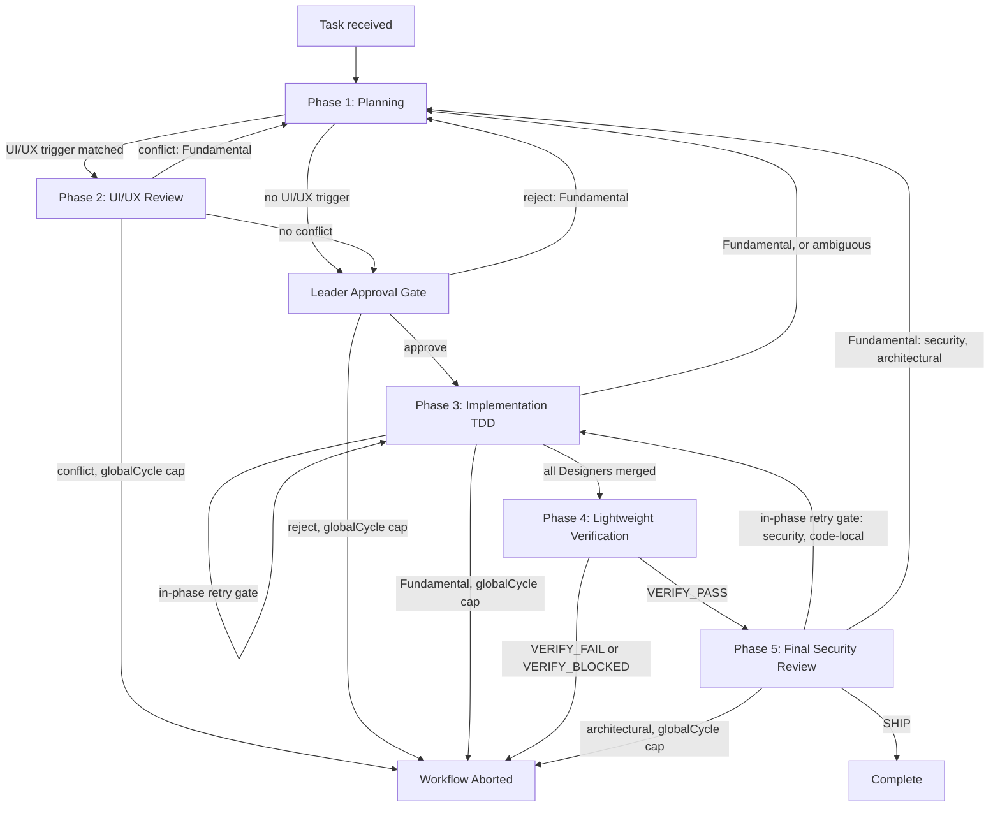

# Team Workflow Orchestration

Orchestrates a multi-agent team through 5 phases with escalation support.

## Quick Reference

- **Escalation**: See `resources/escalation.md` for rules, limits, and report formats

## Orchestration Flow

This is the **visual** rendering of the phase graph — its node set MUST equal `resources/escalation.md`'s transition table `From` ∪ `To` state set (that table is the **rules** SSOT; if the two disagree, the table wins).



## Pre-Flight: Project Profile Check

Before starting any phase, verify `.claude/project-profile/index.md` exists.
- If it exists: include `index.md` content in all agent prompts as context
- If it does NOT exist, branch on whether the project has code yet:
  - **Existing tree** (has `package.json`/`src/`): prompt user to run `/team-init` first, then proceed.
  - **Greenfield** (empty/near-empty repo, no source tree): prompt user to run **`/team-new`** — it bootstraps the project (research → scaffold → profile) and ends by generating the profile `/team-run` then consumes. Do NOT run `/team-init` on an empty repo (it would produce a vacuous profile).

**Loading rule**: Only `index.md` is required. Agents load other profile files on-demand based on relevance (see index.md's file table). Some files may not exist — agents fall back to general best practices.

## Orchestration Mode (read once)

selectMode: **ULTRACODE** iff `workflow()` is callable AND ultracode is active (runtime signal or `CLAUDE_HARNESS_ULTRACODE=1`) AND the step has 2+ independent units; else **STANDARD**. Record the mode in the plan's Orchestration field. Workflow unavailable → STANDARD (hard fallback). See CLAUDE.md "Ultracode Orchestration" for fan-out points and guards.

- **STANDARD**: spawn agents via `Agent()` (the steps below, as written).
- **ULTRACODE**: run the independent Phase 1 architects and Phase 3 designers+merge via the Workflow tool — `parallel()` / `pipeline()`. Phase 4 has one integrated Tester pass; deferred QA is invoked separately via `/team-qa`. Keep the max-5-worktree cap + types→backend→frontend→tests merge order.

**Model per dispatch** (both modes): every `Agent()` call below adds `model=` with the tier the Leader recorded for that dispatch in Team Composition (`opts.model` under ultracode). A dispatch the plan does not list uses the agent's frontmatter default, `opus`. The `team-leader` dispatch itself passes no `model`, so it runs on the session model. When a `sonnet` dispatch fails once or turns out to break a `reference/token-optimization.md` §1 condition, re-dispatch it on `opus`. Effort is never passed; every agent inherits the session effort.

## Phase 1: Planning

### Step 1: Spawn Team Leader

Capture `git rev-parse HEAD` first; it becomes the run's `baseRef` (State Tracking). Then spawn the `team-leader` agent via the Agent tool (subagent_type: `team-leader`) with the task description.
Include `.claude/project-profile/index.md` content (from the user's project CWD) in the prompt.

For `/team` mode: Include instruction "Ask the user about ambiguous decisions."
For `/team-run` mode: Include instruction "Make all decisions autonomously."

### Step 2: Spawn Architects A + B (parallel)

> **Ultracode**: run FE/BE as a Workflow `parallel()` fan-out, and Step 3's two objection passes as a second `parallel()` barrier before the Leader synthesizes (the judge-panel pattern). Standard: the `Agent()` calls below.

After Leader produces rough plan, spawn both architects in parallel:

```
Agent(subagent_type="team-architect-fe", prompt="Leader Plan:\n[plan]\n\nCreate detailed frontend plan.")
Agent(subagent_type="team-architect-be", prompt="Leader Plan:\n[plan]\n\nCreate detailed backend plan.")
```

### Step 3: Cross-Review (two objection passes, no dialog primitive)

Feed each architect the counterpart plan and collect objections only — never a rewrite:

```
Agent(subagent_type="team-architect-fe", prompt="Your plan:\n[FE plan]\n\nCounterpart backend plan:\n[BE plan]\n\nList ONLY: contract mismatches, ordering conflicts, and assumptions the other plan breaks. No rewrite, no restatement.")
Agent(subagent_type="team-architect-be", prompt="Your plan:\n[BE plan]\n\nCounterpart frontend plan:\n[FE plan]\n\nList ONLY: contract mismatches, ordering conflicts, and assumptions the other plan breaks. No rewrite, no restatement.")
```

Leader consumes both objection lists, mediates, finalizes. A conflict neither side concedes →
Leader decides and records the reason in the plan doc. Both passes run in parallel; they are
independent (neither reads the other's objections).

### Step 4: Optional Arch C

If Leader flagged infra/security concerns, spawn Architect C:
```
Agent(subagent_type="team-architect-infra", prompt="Plan:\n[consolidated plan]\n\nReview for infra/security concerns.")
```

### Step 5: Save Plan to _docs/

Write the consolidated plan to `_docs/active/planning/<created>/<created>-<topic>-plan.md` **in the primary working tree** (`_docs/` never lives in a linked worktree — see `parallelization`).
Update `_docs/index.md` with the new entry.

```
_docs/
├── index.md                                            # Always update this
└── active/
    └── planning/
        └── <created>/
            └── <created>-<topic>-plan.md               # Team plan document
```

If the task arrived without an intent (no `_docs/intent/<…>-<topic>-intent.md` exists for this topic), write one first from the Leader's settled framing — `/team-run` often starts from a bare task string, and the ask is what the Phase 5 archive links back to. It is a **collection** doc: never moved, never merged into the `complete/` archive.

The plan document follows the template defined in `team-leader.md` (Plan Document Template section).
Status follows the `docs-lifecycle` skill: `planning` (here) → `processing` (Phase 3) → `complete` (Phase 5, with the sidecar-merge rule). Keep `status` frontmatter in lockstep with the folder, and update `index.md` on every transition.

## Phase 2: UI/UX (Conditional)

Only if Leader indicated UI/UX changes needed:

```
Agent(subagent_type="team-uiux-master", prompt="Plan:\n[plan]\n\nReview and propose UI/UX modifications.")
```

If UI/UX Master reports conflicts → escalate to Phase 1.

## Leader Approval Gate

Present the final plan (Phase 1 + Phase 2 results) to Leader for approval.

- Approve → proceed to Phase 3
- Reject → return to Phase 1 with Leader's feedback

## Phase 3: Implementation (TDD)

### Step 0: Contract Sync gate (conditional)

If Architect B's plan changed the **server contract** AND the frontend consumes a **generated** client (project-profile `api-layer.md` → "Generated Code"), run the `contract-sync` skill BEFORE spawning FE Designers: regenerate the client → isolate churn → authoritative type-check → cross-check consumption sites. Designers implementing against stale generated types is a guaranteed Phase 3 escalation. Skip only when there is no codegen or no contract change.

### Step 1: Parse File Assignments

From Leader's plan, extract Designer assignments:
```
Designer 1: [file-a, file-b] → worktree-1
Designer 2: [file-c, file-d] → worktree-2
```

### Step 2: Spawn Designers (parallel, worktree isolated)

> **Ultracode**: run Designers as a Workflow `parallel()` with `isolation: 'worktree'`, then the sequential merge (Step 3). Max-5-worktree cap + types→backend→frontend→tests merge order still bind. Standard: the `Agent()` calls below.

For each Designer — pass the plan doc's **absolute primary-tree path** so the worktree reads it without cd-ing into another tree (`_docs/` lives ONLY in the primary tree; see `parallelization` → "`_docs/` lives in the primary working tree"):
```
Agent(
  subagent_type="team-designer",
  prompt="Your assignment:\nFiles: [list]\nPlan doc (read in full, absolute path): {MAIN}/_docs/active/planning/<created>/<created>-<topic>-plan.md\nPlan (relevant excerpt): [inline]\n\nImplement using TDD. Write any impl notes/findings to {MAIN}/_docs/… by absolute path — NOT into your worktree's _docs/. Leave index.md and status-moves to the orchestrator.",
  isolation="worktree",
  mode="bypassPermissions"
)
```
where `MAIN=$(dirname "$(git rev-parse --path-format=absolute --git-common-dir)")` (the primary working tree, resolvable from any worktree).

### Step 3: Merge Worktrees

1. Create merge branch from the repo's **current HEAD** (not an arbitrary main/develop — see parallelization §"Base Selection"). Designer worktrees were branched from this same base.
2. Merge each worktree sequentially
3. Resolve any conflicts
4. Commit merged result

Use the run file's `baseRef` as the pre-task base ref, and record the merged HEAD. Phase 4 verifies the **integrated** tree, including contracts between assignments; individual Designer test reports do not establish a quick-verification PASS.

### Step 4: Update _docs/

Update `_docs/active/processing/<created>/<created>-<topic>-plan.md` with implementation notes, merged HEAD, and any deviations from the approved plan. Transition `planning → processing` per `docs-lifecycle` (move to `active/processing/`, bump `updated`, update `index.md`). This `git mv` + `index.md` edit is **orchestrator-serialized** — Designers write their own doc content files to the primary tree by absolute path, but only the orchestrator moves docs and touches `index.md` (see `docs-lifecycle` → Concurrency).

## Phase 4: Lightweight Verification

### Step 1: Spawn one Tester

Run one `team-tester` on the merged HEAD. Scope it to changed unit/integration tests, changed contracts, authoritative type/lint/build gates, and at most one **existing** smoke E2E for each affected user-facing flow (see `team-tester` and `reference/verification-loop.md`). Do not dispatch parallel Testers, perform goal exploration, write broad regression suites, or generate E2E specs here. Pass the pre-task base ref and merged HEAD. If the user explicitly requested a full deterministic suite in this task, pass that request; deeper exploratory QA still waits for `/team-qa`.

```
Agent(
  subagent_type="team-tester",
  prompt="Implementation reports:\n[reports]\n\nPlan:\n[plan]\n\nBase ref: [base-ref]\nMerged HEAD: [merged-head]\n\n[User explicitly requested a FULL deterministic suite this time. Omit this line entirely for the default scoped run.]\n\nRun one lightweight integrated verification pass: affected unit/integration, type/lint/build, and at most one existing smoke E2E per affected user-facing flow. Report evidence and unavailable checks. Do not run deferred QA.",
  mode="bypassPermissions"
)
```

### Step 2: Record the quick-verification result

The orchestrator checks the single Tester report against the merged HEAD and records command, exit/count, baseline comparison, smoke scope, and unavailable checks in the active plan. Reuse checks already run on that exact HEAD; run a missing authoritative check once, without a second broad test pass. `VERIFY_PASS` requires every required quick check to run with no net-new failure against a reliable baseline; record any proven pre-existing failure. `VERIFY_FAIL` or `VERIFY_BLOCKED` ends this run with an incomplete report and an actionable fix/unblock list. Do not automatically return to Phase 3 or Phase 1 from Phase 4. The user can address the issue through `/debug` or a new `/team` task; `/team-qa` is for deeper deferred scenarios after implementation completes.

## Phase 5: Final Security Review

Always invoke Architect C:

```
Agent(
  subagent_type="team-architect-infra",
  prompt="Implemented code diff:\n[git diff]\n\nPerform final security audit.",
  mode="bypassPermissions"
)
```

- SHIP → first reconcile the plan against the final HEAD, quick-verification/security evidence, remaining unverified checks, and changed code/contracts. Resolve stale statements and links; run the `docs-lifecycle` freshness check and `wiki` update-or-confirm check. Consider the Tester's QA candidates and derive **up to five** risk-ordered scenarios from acceptance criteria that the quick checks did not cover. Write them under `## Deferred QA` using the exact `docs-lifecycle` entry contract, with IDs based on the final archive filename stem. For a task with no behavior needing later QA, write `- No scenarios: <specific reason>` under that heading instead of inventing scenarios. Do not execute these scenarios here. Then transition the plan `processing → complete` per `docs-lifecycle` (apply the **merge rule**: consolidate spec + plan + metrics + findings into one `complete/` doc, `git rm` sidecars, update `index.md`). **The intent is NOT a sidecar** — it stays in `_docs/intent/`; the archive links back to it via `related:`. Promote the learnings created or modified since the run file's `startedAt` per `continuous-learning` §4 → "Promote project-valid learnings out of session-state" (project knowledge → `_docs/reference/`, operational facts → project-profile, agent-only know-how stays), so they fall inside the sweep below. Run `/docs-sweep --since <baseRef>` (the run file's `baseRef`) on the completed tree: resolve the index/link defects and reap proposals for this run's documents, and list out-of-scope findings in the report without fixing them, before reporting implementation completion. The report states quick checks, unverified checks, pending QA count, completed plan path, and `/team-qa` as the later execution entry point. `status: complete` means implementation completed, not that deferred QA passed.
- Issues found → escalate per escalation rules

## Escalation Handling

On any escalation, route via `resources/escalation.md`'s transition table — it is the single source of truth for classification, target phase, counter effects, and abort thresholds. Do not re-derive these rules inline here.

## State Tracking

Run state is **persisted to disk**, not held in orchestrator memory — one file per plan at `$(dirname "$(git rev-parse --path-format=absolute --git-common-dir)")/.claude/session-state/runs/<plan-id>.json`, where `<plan-id>` is the plan filename stem. Use that primary-tree absolute path: a linked worktree's relative `.claude/session-state/` is a different, empty directory. The session's own id is `$CLAUDE_CODE_SESSION_ID`. Layout: `checkpoint` skill → Storage. This is a read/write contract:

- **Create** the file in Phase 1 as soon as the plan file's name is fixed: `runId`, `owner_session: $CLAUDE_CODE_SESSION_ID`, `startedAt`, `updated_at`, `baseRef` (the `git rev-parse HEAD` captured before Step 1 spawns the Leader — the first docs of the run are written after it), `phase: "P1"`, all `retries` zeroed, `globalCycle: 1`.
- **Read** the file on every phase entry. Never rely on in-context recall for `phase`, `retries`, or `globalCycle`.
- **Owner check before every write**: if `owner_session` is not this session's id, STOP and ask the user — another session is driving this run, or a crashed one left it. Change `owner_session` to this session only when the user says to take the run over. No time threshold decides this; the user does.
- **Write** the file on every transition (every phase entry/exit and every escalation), applying the counter effect from the matching `escalation.md` transition-table row and refreshing `updated_at`.
- **Abort decisions** are made by reading the file's current counters, never from conversation memory.
- **Missing file at any phase after P1** (post-`git clean -xdf`, cwd change, resumed run): STOP and surface — the counters are unrecoverable. Do NOT recreate with zeroed counters; that silently resets the very abort caps this file exists to enforce.
- Different plans use different files, so parallel team runs in one tree do not collide. Per the parallel-session safety rule (root `CLAUDE.md` → "Parallel sessions share the working tree — commit only what you changed, never revert what you didn't"), never edit another plan's run file.
