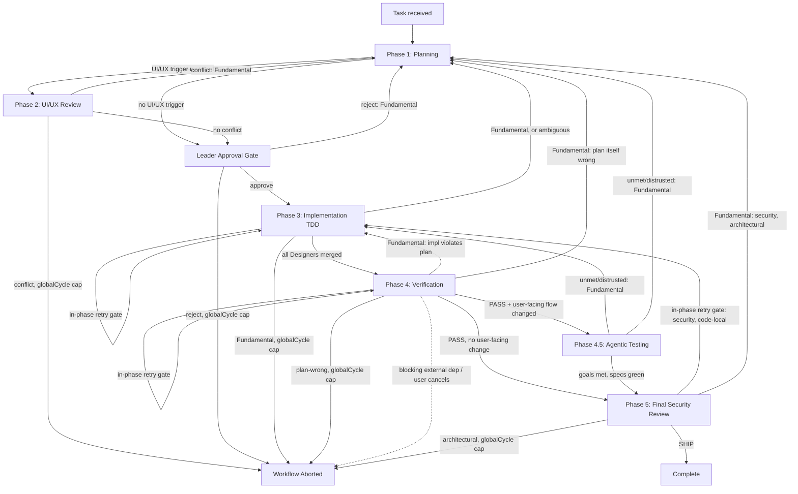

# Team Workflow Orchestration

Orchestrates a multi-agent team through 5 phases with escalation support.

## Quick Reference

- **Escalation**: See `resources/escalation.md` for rules, limits, and report formats

## Orchestration Flow

This is the **visual** rendering of the phase graph — its node set MUST equal `resources/escalation.md`'s transition table `From` ∪ `To` state set (that table is the **rules** SSOT; if the two disagree, the table wins).



## Pre-Flight: Project Profile Check

Before starting any phase, verify `.claude/project-profile/index.md` exists.
- If it exists: include `index.md` content in all agent prompts as context
- If it does NOT exist, branch on whether the project has code yet:
  - **Existing tree** (has `package.json`/`src/`): prompt user to run `/team-init` first, then proceed.
  - **Greenfield** (empty/near-empty repo, no source tree): prompt user to run **`/team-new`** — it bootstraps the project (research → scaffold → profile) and ends by generating the profile `/team-run` then consumes. Do NOT run `/team-init` on an empty repo (it would produce a vacuous profile).

**Loading rule**: Only `index.md` is required. Agents load other profile files on-demand based on relevance (see index.md's file table). Some files may not exist — agents fall back to general best practices.

## Orchestration Mode (read once)

selectMode: **ULTRACODE** iff `workflow()` is callable AND ultracode is active (runtime signal or `CLAUDE_HARNESS_ULTRACODE=1`) AND the step has 2+ independent units; else **STANDARD**. Record the mode in the plan's Orchestration field. Workflow unavailable → STANDARD (hard fallback). See CLAUDE.md "Ultracode Orchestration" for fan-out points and guards.

- **STANDARD**: spawn agents via `Agent()` / `TeamCreate` (the steps below, as written).
- **ULTRACODE**: run the named fan-outs (Phase 1 architects, Phase 3 designers+merge, Phase 4 testers, Phase 4.5 agentic pipeline) via the Workflow tool — `parallel()` / `pipeline()`. Keep the max-5-worktree cap + types→backend→frontend→tests merge order; serialize the shared Playwright MCP browser.

## Phase 1: Planning

### Step 1: Spawn Team Leader

Spawn the `team-leader` agent via the Agent tool (subagent_type: `team-leader`) with the task description.
Include `.claude/project-profile/index.md` content (from the user's project CWD) in the prompt.

For `/team` mode: Include instruction "Ask the user about ambiguous decisions."
For `/team-run` mode: Include instruction "Make all decisions autonomously."

### Step 2: Spawn Architects A + B (parallel)

> **Ultracode**: run FE/BE as a Workflow `parallel()` fan-out (cross-review in Step 3 stays `TeamCreate`). Standard: the `Agent()` calls below.

After Leader produces rough plan, spawn both architects in parallel:

```
Agent(subagent_type="team-architect-fe", prompt="Leader Plan:\n[plan]\n\nCreate detailed frontend plan.")
Agent(subagent_type="team-architect-be", prompt="Leader Plan:\n[plan]\n\nCreate detailed backend plan.")
```

### Step 3: Cross-Review

Use TeamCreate to create a dialog between Leader + Arch A + Arch B.
Each reviews the other's plan. Leader mediates and finalizes.

### Step 4: Optional Arch C

If Leader flagged infra/security concerns, spawn Architect C:
```
Agent(subagent_type="team-architect-infra", prompt="Plan:\n[consolidated plan]\n\nReview for infra/security concerns.")
```

### Step 5: Save Plan to _docs/

Write the consolidated plan to `_docs/active/planning/<created>/<created>-<topic>-plan.md` **in the primary working tree** (`_docs/` never lives in a linked worktree — see `parallelization`).
Update `_docs/index.md` with the new entry.

```
_docs/
├── index.md                                            # Always update this
└── active/
    └── planning/
        └── <created>/
            └── <created>-<topic>-plan.md               # Team plan document
```

The plan document follows the template defined in `team-leader.md` (Plan Document Template section).
Status follows the `docs-lifecycle` skill: `planning` (here) → `processing` (Phase 3) → `complete` (Phase 5, with the sidecar-merge rule). Keep `status` frontmatter in lockstep with the folder, and update `index.md` on every transition.

## Phase 2: UI/UX (Conditional)

Only if Leader indicated UI/UX changes needed:

```
Agent(subagent_type="team-uiux-master", prompt="Plan:\n[plan]\n\nReview and propose UI/UX modifications.")
```

If UI/UX Master reports conflicts → escalate to Phase 1.

## Leader Approval Gate

Present the final plan (Phase 1 + Phase 2 results) to Leader for approval.

- Approve → proceed to Phase 3
- Reject → return to Phase 1 with Leader's feedback

## Phase 3: Implementation (TDD)

### Step 0: Contract Sync gate (conditional)

If Architect B's plan changed the **server contract** AND the frontend consumes a **generated** client (project-profile `api-layer.md` → "Generated Code"), run the `contract-sync` skill BEFORE spawning FE Designers: regenerate the client → isolate churn → authoritative type-check → cross-check consumption sites. Designers implementing against stale generated types is a guaranteed Phase 3 escalation. Skip only when there is no codegen or no contract change.

### Step 1: Parse File Assignments

From Leader's plan, extract Designer assignments:
```
Designer 1: [file-a, file-b] → worktree-1
Designer 2: [file-c, file-d] → worktree-2
```

### Step 2: Spawn Designers (parallel, worktree isolated)

> **Ultracode**: run Designers as a Workflow `parallel()` with `isolation: 'worktree'`, then the sequential merge (Step 3). Max-5-worktree cap + types→backend→frontend→tests merge order still bind. Standard: the `Agent()` calls below.

For each Designer — pass the plan doc's **absolute primary-tree path** so the worktree reads it without cd-ing into another tree (`_docs/` lives ONLY in the primary tree; see `parallelization` → "`_docs/` lives in the primary working tree"):
```
Agent(
  subagent_type="team-designer",
  prompt="Your assignment:\nFiles: [list]\nPlan doc (read in full, absolute path): {MAIN}/_docs/active/planning/<created>/<created>-<topic>-plan.md\nPlan (relevant excerpt): [inline]\n\nImplement using TDD. Write any impl notes/findings to {MAIN}/_docs/… by absolute path — NOT into your worktree's _docs/. Leave index.md and status-moves to the orchestrator.",
  isolation="worktree",
  mode="bypassPermissions"
)
```
where `MAIN=$(dirname "$(git rev-parse --path-format=absolute --git-common-dir)")` (the primary working tree, resolvable from any worktree).

### Step 3: Merge Worktrees

1. Create merge branch from the repo's **current HEAD** (not an arbitrary main/develop — see parallelization §"Base Selection"). Designer worktrees were branched from this same base.
2. Merge each worktree sequentially
3. Resolve any conflicts
4. Commit merged result

### Step 4: Update _docs/

Update `_docs/active/processing/<created>/<created>-<topic>-plan.md` with implementation notes. Transition `planning → processing` per `docs-lifecycle` (move to `active/processing/`, bump `updated`, update `index.md`). This `git mv` + `index.md` edit is **orchestrator-serialized** — Designers write their own doc content files to the primary tree by absolute path, but only the orchestrator moves docs and touches `index.md` (see `docs-lifecycle` → Concurrency).

## Phase 4: Verification

### Step 1: Spawn Testers (parallel)

> **Ultracode**: run one Tester per Designer as a Workflow `parallel()` fan-out. Standard: the `Agent()` call below.

Testing is scoped to this task's changes by default (see `verification-loop` §Phase 4 and `team-tester` Steps 1/5) — pass the base ref (the pre-task HEAD the worktrees branched from, per Phase 3 Step 3) so Tester can compute the diff. Only add the full-run line when the user's current request explicitly asked for a full/total test run; omit it entirely otherwise so Tester defaults to scoped.

```
Agent(
  subagent_type="team-tester",
  prompt="Implementation reports:\n[reports]\n\nPlan:\n[plan]\n\nBase ref (scope tests to changes since this commit): [base-ref]\n\n[User explicitly requested a FULL/total test run this time — run the complete suite. Omit this line entirely for the default scoped run.]\n\nVerify all tests pass.",
  mode="bypassPermissions"
)
```

### Step 2: Collect Results

If all tests pass → append test results to the `_docs/` plan (status stays `processing` until ship) → proceed to Phase 4.5.
If failures → check escalation rules (resources/escalation.md).

## Phase 4.5: Agentic Testing (conditional)

Trigger: Phase 4 = PASS AND a user-facing flow changed.

1. Enforce the `agentic-testing` precondition (project-profile present + adapter section + not stale). If unmet → instruct `/team-init`, skip Phase 4.5 (non-blocking).
2. **STANDARD mode**: `Agent(subagent_type="team-agentic-tester", prompt="Plan + team-tester report + adapter from testing.md. Explore goals, verify, crystallize specs.", mode="bypassPermissions")` (sequential).
3. Consume its report: unmet/distrusted goals → escalate; green generated specs join the deterministic suite.

(Ultracode mode runs the agentic-testing Workflow pipeline instead — see "Orchestration Mode".)

## Phase 5: Final Security Review

Always invoke Architect C:

```
Agent(
  subagent_type="team-architect-infra",
  prompt="Implemented code diff:\n[git diff]\n\nPerform final security audit.",
  mode="bypassPermissions"
)
```

- SHIP → transition the plan `processing → complete` per `docs-lifecycle` (apply the **merge rule**: consolidate spec + plan + metrics + findings into one `complete/` doc, `git rm` sidecars, update `index.md`), then report success to user
- Issues found → escalate per escalation rules

## Escalation Handling

On any escalation, route via `resources/escalation.md`'s transition table — it is the single source of truth for classification, target phase, counter effects, and abort thresholds. Do not re-derive these rules inline here.

## State Tracking

Run state is **persisted to disk**, not held in orchestrator memory — `.claude/session-state/team-run.json` (schema + storage rules: `checkpoint` skill's team-workflow integration table). This is a read/write contract:

- **Read** the file on every phase entry. Never rely on in-context recall for `phase`, `retries`, or `globalCycle`.
- **Write** the file on every transition (every phase entry/exit and every escalation), applying the counter effect from the matching `escalation.md` transition-table row.
- **Abort decisions** are made by reading the file's current counters, never from conversation memory.
- **Missing file at P1** (fresh run): create it — `runId`, `phase: "P1"`, all `retries` zeroed, `globalCycle: 1`.
- **Foreign `runId` found on read, with `phase ∉ {DONE, ABORT}`**: STOP and surface to the user (a live parallel run or a crashed one) — do NOT silently overwrite. Per this repo's parallel-session safety rule (root `CLAUDE.md` → "Parallel sessions share the working tree — commit only what you changed, never revert what you didn't").
